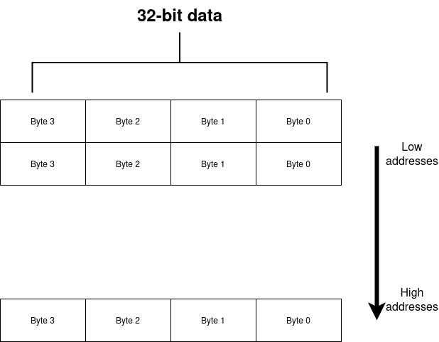

# riscv_single_core
## Overview
FPGA (Verilog based) implementation of a single core, unpipelined (and single cycle), 32-bit RISC-V processor, according to RV32I.
Key features:
- 37 instructions
- machine mode only
- single-cycle, unpipelined
- CSRs, interrupts, timers and exceptions are not supported for simplicity

### Instructions
1. Integer arithmetic (register–register and immediate)

```ADD, SUB, SLT, SLTU, AND, OR, XOR, SLL, SRL, SRA```

1.1 Immediate forms:

 ```ADDI, SLTI, SLTIU, ANDI, ORI, XORI, SLLI, SRLI, SRAI```

2. Load and store

Loads: ```LB, LH, LW, LBU, LHU```

3. Stores: ```SB, SH, SW```

4. Control transfer (branches and jumps)

Conditional branches: ```BEQ, BNE, BLT, BGE, BLTU, BGEU```

5. Jumps: ```JAL, JALR```

6. Unconditional: ```AUIPC, LUI```

### Registers:
Registers mapping (by default)
|          |               function              |
|:--------:|:-----------------------------------:|
| ```x0``` | hard-wired to ```32'b0```           |
| ```x1``` | ```ra```: return address for a call |
| ```x2``` |       ```sp```: stack pointer       |
| ```x5``` |       alternate link register       |

Each register is 32-bit.

### Memory
This project utilizes byte addressable memory layout. It uses very simple custom implementations of dual-port BRAMs for both data and instructions. Due to the single-cycle nature of this core both BRAMs work within a single cycle which is more a wishful thinking than the reality.



#### Writing testbenches
In order to test the core a RISC-V 32-bit assembly program has to be writen. The program should be stored in a respective directory for instance: ```data/s_type/```. Each program should have a memory file as well which file will be used to initialize data BRAM.

In the testbench module the following lines should be use to load respective BRAMs with proper information. Number of instructions and lines of data should be specified as well.

```verilog
inst_numb = 16; // example value
data_numb = 3;  // example value

// Loading data into data BRAM (uses RISCV_PROGRAMS macro to data/)
$readmemh({`RISCV_PROGRAMS, "instr_type/program_data.hex"}, init_mem_data);

// Loading program into instruction BRAM (uses RISCV_PROGRAMS macro to data/)
$readmemh({`RISCV_PROGRAMS, "instr_type/program.new.hex"}, init_mem_instr);
```

After creating program it has to be compiled and turned into ```.hex``` file. In order to do so use the following Python script located in ```data/```.
Use the pipeline:
```bash
python3 rv322coe.py --file path/filename.S
```

It doesn't require any special environment only risc-v compiler.

### Running simulation and build
Project's structure and build system follows the template from my base [FPGA project](https://github.com/szymek1/FPGA-TCL-Makefile-template).

Due to that every source file should be placed inside: ```src/hdl/```. While every testbench inside: ```src/sim/```. 

To run a simulation execute:

```make sim_sel TB=module_tb``` - single, selected testbench

or

```make sim_sel TB="module1_tb module2_tb ..."``` - multiple selected testbenches

or

```make sim_all``` - all testbenches which are inside ```src/sim/```

In either case results will be saved to ```simulation/waveforms``` and logs of the successfull/unsuccessfull runs will be saved to ```log/```.

This project currently doesn't synthesize, however in order to build it execute:
```make bit```

### Target
The target device for this project is [Zybo Z7: Zynq-700](https://digilent.com/reference/programmable-logic/zybo-z7/start). Although this code is not syntesizeable.

### Credits
This work was done under and influence and an immense guidelines of [HolyCore](https://github.com/0BAB1/HOLY_CORE_COURSE). Thank you Hugo for the support <3
